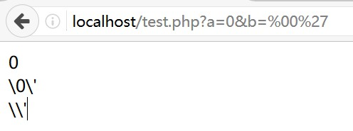

吐槽一下，整篇文章的编排都比较的乱。
## 简介
之前看了seay写的PHP代码审计的书，全部浏览了一遍，作为代码审计小白，希望向一些和我一样的小白的人提供一下我的收获，以及一个整体的框架和常见函数漏洞。这也算是这本书的一个学习笔记吧，可以结合我捋顺的思思路来看这本书。:)

## 整体
学习代码审计的目标是能够独立完成对一个CMS的代码安全检测。其通用思路有：
- 通读全文代码，从功能函数代码开始读，例如`include`文件夹下的`common_fun.php`，或者有类似关键字的文件。
- 看配置文件，带有`config`关键字的文件，找到`mysql.class.php`文件的`connect()`函数，查看在数据库连接时是否出现漏洞。
- 继续跟读首页文件`index.php`，了解程序运作时调用了哪些函数和文件。以`index.php`文件作为标线，一层一层去扩展阅读所包含的文件，了解其功能，之后进入其功能文件夹的首页文件，进行扩展阅读。

## 各种洞洞
### 文件操作漏洞
1. 能不用文件参数就不用， 尽量不让用户可控
2. 平行用户的权限 管理员的权限 操作权限
3. 禁止传入参数类似于`..`、`\`、`/`，检查传入的参数，做出限制，停止程序往下执行

#### 文件包含漏洞
##### 本地文件包含：
- 一般存在于模块加载、模板记载、cache调用
- 包含函数：`include()`、`include_once()`、`require()`、`require_once()`寻找可控变量
```PHP
1.php
<?php
dirfine("ROOT",dirname(__FILE__).'/');
$mod = $_GET['mod'];
include(ROOT.$mod.'.php');

2.php
<?php phpinfo();?>
```


##### 远程文件包含：
- 前提条件：`allow_url_include=on`
- 出现的频率不如本地

##### 文件包含截断
- %00截断(php版本小于5.3)
- 问号阶段(问号后面相当于请求的参数，伪截断)
- 英文(.) 反斜杠(/) 截断

#### 文件读取(下载)漏洞：
搜索关键函数：
```PHP
file_get_contents(),highlight_file(),fopen(),read file(),fread(),fgetss(), fgets(),parse_ini_file(),show_source(),file()
```

#### 文件上传漏洞：
搜索关键函数：
`move_uploaded_file()`，接着看调用这个函数的代码是否存在未显示上传格式或者可以绕过。
- 未过滤或本地过滤：服务器端未过滤，直接上传PHP格式的文件即可利用
- 黑名单扩展名绕过：
    - 限制不够全面:IIS默认支持解析`.asp`,`cdx`,`.asa`,`.cer`等。
    - 扩展名可绕过
    ```PHP
    function getExt($filename) {
        return substr($filename,strripos($filename,'.')+1);
    }

    $disallowed_types = array("php","asp","aspx");
    $filenameExt = strtolower(getExt($_FILES['file']['name']));
    if(in_array($filenameExt,$disallowed_types)) {
        die('disallow type');
    } else {
        $filename = time().'.'.$filenameExt;
        move_uploaded_file($_FILES['file']['temp'],'upload/'.$filename);
    }
    ```
    不被允许的文件格式`.php`,但是我们可以上传文件名为`1.php `(注意后面有个空格)
- 文件头content-type验证
    - `getimagesize()`函数：验证文件头只要为`GIF89a`，就会返回真。
    - 限制`$_FILE["file"]["type"]`的值，就是人为地限制`content-type`为可控变量

- 防范
    - 使用`in_array()`或利用三等于`===`对比扩展名
    - 保存文件是重命名，规则采用时间戳拼接随机数:`md5(time()+rand(1,1000))`


#### 文件删除漏洞
搜索关键函数：
- unlink()利用回溯变量的方式。老版本下的`session_destory()`可以删除文件，现已被修复。

**Metinfo的任意文件删除漏洞**
```PHP
$action = $_GET['action'];
$filenames = $_GET['filename'];
if($action = 'delete') {
    if(is_array($filenames)) {
        foreach ($filenames as $filename) {
            unlink('../databack/'.$filename);
        }
    }
} else {
    if(fileext($filenames) == "sql") {
        $filenamearray = explode(".sql",$filename);
        unlink('../../databack/'.$filename);
        unlink('../../databack/sql/metinfo_'.$filenamearray[0].'zip');
    } else {
        unlink('../../databack/'.$fileon.'/'.$filename);
    }
}
```
`$action=delete`即可删除`.sql`文件，如果文件不是sql直接删除提交的文件名

`target.com/recovery.php?action=delete&filename=../../index.php`


### 代码执行漏洞
#### 代码执行函数
搜索函数
```PHP
eval(), assert(), preg_replace(), call_user_func(), call_user_func_array(), array_map(),preg_match()+/e,call_user_func()
```

##### eval()和assert()
当assert()的参数为字符串时 可执行PHP代码
```PHP
eval("phpinfo();");  正确
eval("phpinfo() ");  错误
assert("phpinfo();");正确
assert("phpinfo() ");错误          
```

#### 动态函数执行
```PHP
<?php $_GET['a']($_GET['b']);?>
```

#### 命令执行函数
```PHP
system(), exec(), shell_exec(), passthru() ,pcntl_exec(), popen(),proc_open()
```
##### popen和proc_open()
```PHP
<?php
popen('whoami >> /user/xxx/Desktop/1.txt','r');
>
```
所在路径就会出现一个`1.txt`,里面的内容为命令执行后的结果。

##### 反引号命令执行
- echo \`whoami\`:直接执行命令
- 双引号和单引号的区别:
    ```PHP
    $a = 1;
    echo "$a"   输出 1
    echo '$a'   输出 $a
    ```
    双引号时，可以直接解析变量，造成代码执行漏洞。

##### 变量覆盖漏洞
- 函数使用不当
    - extract()
    - parse_str()
    - import_request_variables()

- $$变量覆盖
```PHP
$a = 1;
foreach (array("_COOKIE","_POST","_GET") as $_request) {
    foreach ($$_request as $_key=>$value) {
        echo $_key."<br>";
        $$_key = addslashes($value);
    }
}
echo $a;
```


##### 逻辑漏洞
需要思考的问题：
- 程序是否可以重复安装
- 修改密码师傅存在越权修改
- 找回密码验证码是否可以爆破
- cookie是否可以预测，存在验证绕过

###### 等于与存在判断绕过
- in_array(),比较之前会自动转换类型
    ```PHP
    if(in_array($_GET['type_id'],array(1,2,3,4))) {
        $sql = "select ... where type_id='".$_GET['type_id']."'";
        echo $sql;
    }
    ```
    

- is_numeric()，当传入参数为hex时 直接通过并返回true并且MYSQL可以直接使用hex编码代替字符串明文，可以二次注入并且可能造成XSS漏洞
- 双等于和三等于
    - 双等于会在变量比较时，进行类转换，与`in_array()`是一样的问题。
    - 三等于是**type**和**value**的双重比较，相比之下更安全。

###### 账户体系中的越权问题
- 水平越权，A用户能够以B用户的身份，进行B用户的全部权限操作。前提A用户和B用户拥有相同的权限。
- 垂直越权，A用户能够以C用户的身份，进行C用户的全部权限操作，前提C用户比A用户拥有更高的权限。

1. 为exit/return/die
```PHP
if(file_exists('install.lock')) {
    header('localtion:index.php');
}
```
2. 支付漏洞
- 客户端修改单价
- 客户端修改总价和购买数量
- 服务端为校验严格
- 重复发包利用时间
    ```PHP
    if (check_money($price)) {
        //Do something
        //花费几秒
        $money = $money - $price;
    }
    ```

##### 可能导致漏洞函数:str_replace()
```PHP
$order_sn = str_replace($_GET['subject'],$_GET['out_trade_no']);
$order_sn = trim($order_sn);
if(!check_monkey($order_sn,$_GET['total_fee'])) {
    //省略
}

function check_monkey($log_id,$monkey) {
    $sql = "select order_amount from xx WHERE log_id='".$log_id."'";
}
```
等价于
```PHP
<?php
$a = addslashes($_GET['a']);
$b = addslashes($_GET['b']);
echo "$a<br/>$b<br/>";
$c = str_replace($a,'',$b);
echo trim($c);
>
```


##### 会话认证漏洞
- cookie验证：没有使用SESSION验证，将信息直接保存在COOKIE中
    1. 找到传入sql语句的参数的传递过程 回溯变量到最原始的函数 看它保存在cookie的算法是否可逆
    2. 和MD5相比 sha1更安全 解密sha1的网站更少
    3. 限制一个用户只能同时在一个IP登录
- 审计代码是，查看登录处的代码

##### 二次漏洞
1. 类型
    - 不是逻辑问题，是可信问题
    - 业务逻辑复杂度，与二次漏洞触发率成正比
    - 购物车 订单/引用数据/文章编辑/草稿；SQL注入/XSS

2. 技巧
    - 不受GPC保护的`$_SERVER`变量:PHP5以后，$_SERVER取到的header不再受GPC影响，就算开启特殊字符也不会被转义，存在注入；
    - 编码问题转换：
        1. GBK的宽字节注入：`%df'`。单引号自动被转移成`%5c`,同时`%df`与`%5c`连在一起组合成**運**字单引号依然在，成功闭合。[php与mysql交互过程中发生的编码转换问题]
        2. mb_convert_encoding()
        ```PHP
        $sql = "WHERE id='".urldecode("-1%df%5c' == ")."'";
        print_r(mb_convert_encoding($sql,"UTF-8","GBK"));
        ```
    - 字符串问题：
        1. 利用报错，找到敏感信息
        2. 字符串截断
            1. `%00`空字符阶段(php版本小于5.3)
            2. iconv函数字符编码转换截断，chr(128)-chr(255)可以截断字符串(php的5.4的版本都可以)
    - php:// 输入输出流
        ```PHP
            include($_GET['file'])
        ```
        访问URL,`1.php?file=php://filter/convert.base64-encode(内容被base64编码)/resource=example.txt(远程文件`
    
    - php代码解析标签
        1. `<script language="php">...</script>`
        2. `<?...?>` php3.0.4版本后可用
        3. `<%...%>` asp标签，需要`asp_tag=on`，默认是`off`
    
    - 正则表达式
        1. 没有使用`^`和`$`限定匹配开始位置
        2. 特殊字符未转义
    
    - 报错注入
        ```PHP
        $conn = mysql_connect("localhost","root","root");
        mysql_select_db("test",$conn);
        $sql1 = "select 1 from (select count(*),concat(user(),floor(rand(0)*2))x from information_schema.tables group by x) a";
        $sql2 = "select * from user where id=1 and (extractvalue(1,concat(ox7e,(select user()))))";
        $sql3 = "select * from user where id=1 and (updatexml(1,concat(0x7e,(select user()))),1)";
        ```

    - windows findfirstfile,利用搜索12345.txt文件，可以使用`1<<`来代替或者`12<<`，不可以单独使用一个`<`或`>`,因为单独一个只代表了一个字符，两个代表多个字符。

    ## End
    自己走上安全这条路既是兴趣也是偶然，选择白盒完全是因为喜欢php，毕竟是初识代码审计，seay的书确实帮了我不少，报作者大腿，希望这篇文章能够帮助像我一样小白的人，花了两天总结的，如果有什么缺陷也等着大家指点。
    > 不会开发的谈审计都是耍流氓! :)


